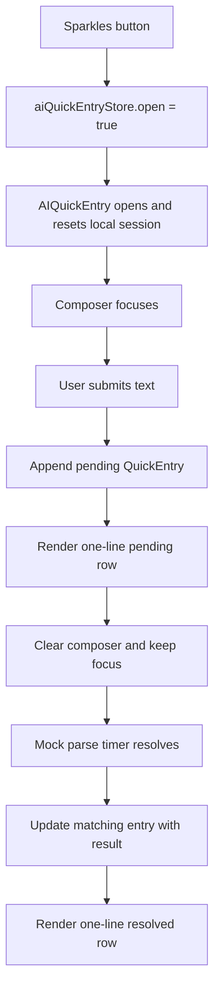

# AI Quick Entry Rapid Queue — Design

**Date:** 2026-05-30
**Branch:** `dev-polish-chat`
**Status:** Proposed for review

## Summary

Redesign the bottom-nav AI Quick Entry overlay for rapid multi-expense entry.
The current UI works for one entry, but repeated submissions create a tall stack
of pending skeletons and full expense cards. The revised design treats the
overlay as a compact queue: each submitted expense is represented by exactly one
single-line row above the composer.

The row layout is fixed:

```txt
[icon]  note or submitted input                         amount
```

There are no chat bubbles, no two-line compact rows, and no expanded cards in
this phase. The user can submit several expenses quickly while the composer
stays pinned, focused, and ready for the next entry.

This remains a UI-only / mock-parse phase. Real parsing, persistence, edit, and
review flows are out of scope unless a later spec adds them.

## Goals

- Support fast entry of multiple expenses in one overlay session.
- Keep each entry to one compact visual row.
- Keep the composer fixed above the keyboard and focused after every send.
- Show newest entries closest to the composer.
- Show pending, resolved, and failed states without increasing row height.
- Avoid the current full-card stack that quickly consumes the mobile viewport.
- Preserve the existing mock parse flow and local-only session behavior.
- Prioritize iPhone 13/14 viewport quality.

## Non-Goals

- No real `/api/ai/parse-expense` call.
- No expense create mutation.
- No background sync.
- No bulk save.
- No row expansion.
- No full `ExpenseListItem` cards inside the quick queue.
- No persistent session history after closing the overlay.
- No change to the full `/ai` chat page.
- No change to the bottom-nav Sparkles trigger.

## Current Context

`AIQuickEntry.tsx` currently owns local `entries`, `composer`, and mocked parse
timers. On submit, it appends a pending entry, clears the composer, and later
replaces the pending UI with a real `ExpenseListItem` generated by
`mockParseExpense`.

The problem is not the submit lifecycle. The problem is presentation:

- Pending entries are shaped like large skeleton cards.
- Resolved entries become full expense cards.
- Multiple submissions quickly fill the `max-h-[50vh]` queue area.
- The UI starts to feel like a history screen instead of a fast input tool.

The lifecycle should stay mostly the same; the row presentation should change.

## UX Model

The overlay is a rapid queue, not a chat.

```txt
┌─────────────────────────────┐
│  4 entries · 1 parsing       │
│                             │
│  ◉ Cà phê sáng nay    -35k   │
│  ◉ Grab về nhà        -80k   │
│  … Bánh mì 25k          --   │
│                             │
│  [ Cơm trưa 60k        ↑ ]   │
└─────────────────────────────┘
```

The user flow:

1. User opens AI Quick Entry from the bottom nav.
2. Composer focuses above the keyboard.
3. User types an expense and sends.
4. The submitted text appears in a one-line pending row.
5. Composer clears and remains focused.
6. User can immediately type the next expense.
7. Each pending row resolves independently into a one-line resolved row.
8. Closing the overlay discards the local session.

## Layout

The overlay keeps three zones:

1. **Session status:** small text above the queue, shown only when entries exist.
2. **Queue:** scrollable list of one-line rows.
3. **Composer:** fixed input and send button above the keyboard.

### Session Status

Purpose: summarize the temporary queue without adding controls.

Examples:

- `1 entry · parsing`
- `4 entries · 1 parsing`
- `6 entries`
- `3 entries · 1 failed`

Rules:

- Show only after the first entry is submitted.
- Keep it visually quiet: small `text-muted-foreground`.
- Align it with the same `max-w-[390px]` column as the queue.
- Do not make it a card.
- Do not add instructional copy.

### Queue

Rules:

- Keep the existing mobile column width: `max-w-[390px]`.
- Keep a capped height near the current `max-h-[50vh]`.
- Use `overflow-y-auto` and hide the scrollbar.
- Newest entries appear at the bottom, directly above the composer.
- Auto-scroll to bottom after submit.
- Auto-scroll to bottom after resolve for this phase.
- Every row has the same height to prevent layout shift.

## One-Line Row Design

Create a dedicated `AIQuickEntryRow` component. It replaces both the current
`AIEntrySkeleton` pending card and the full `ExpenseListItem` resolved card
inside this overlay.

### Row Grid

All states use the same grid:

```txt
grid-cols-[44px_minmax(0,1fr)_auto]
```

Slots:

- **Left:** icon, pending indicator, or failed indicator.
- **Middle:** note or submitted input, one line only.
- **Right:** amount, placeholder, or failed marker.

Text rules:

- Middle text is `truncate`.
- Amount uses `tabular-nums`.
- Amount never overlaps the note.
- Row height is stable, target `48-56px`.
- Touch target is at least `44px`.

### Pending Row

Purpose: confirm the app captured the user's input and is parsing it.

Layout:

```txt
[pulse]  submitted input                              --
```

Details:

- Left uses a pulsing neutral circle or small spinner-like indicator.
- Middle shows the exact submitted input, trimmed, one line.
- Right shows a muted placeholder such as `--` or a short skeleton amount bar.
- No separate user bubble.
- No second line.
- No category, budget, paid-by, or helper text.

### Resolved Row

Purpose: confirm the parser understood the expense.

Layout:

```txt
[icon]  parsed note                                -35k
```

Details:

- Left shows the parsed category icon for now.
- Middle shows `result.note || entry.input`, one line.
- Right shows formatted negative amount.
- The row remains compact after resolving.
- Do not render `ExpenseListItem` in the queue.
- Do not show category name, budget name, paid-by, or sync status in this phase.

### Failed Row

Purpose: leave a clear one-line trace when parsing fails in a later integration
phase.

Layout:

```txt
[!]  original input                              Review
```

Details:

- Left uses a warning icon or failed indicator.
- Middle shows the original submitted input.
- Right shows `Review` or a compact warning marker.
- Still one line.
- Detailed error handling is deferred to real parser integration.

## Interaction

### Submit

The submit behavior remains close to current code:

1. Trim `composer`.
2. Ignore empty input.
3. Append a pending `QuickEntry`.
4. Clear the composer.
5. Trigger medium haptic feedback.
6. Keep focus in the composer.
7. Start the mock parse timer.
8. Resolve only the matching entry.

### Repeated Entry

Repeated submits are allowed. The user should not need to wait for previous
entries to resolve before typing the next one.

Example:

```txt
User sends: "Cà phê 35k"
Pending row appears.
Composer clears.
User sends: "Bánh mì 25k"
Second pending row appears.
Both rows resolve independently.
```

### Row Tap

Rows do not expand in this phase.

If rows remain tappable for future integration, tapping should be inert or
reserved for later edit/review behavior. Do not add a visible expanded state in
this spec.

### Dismiss

- Tapping the scrim closes the overlay.
- Composer blurs.
- The next open starts with an empty queue.

## Component Design

### `AIQuickEntry.tsx`

Responsibilities:

- Read `open` from `useAIQuickEntryStore`.
- Hide on `/ai`.
- Own local `composer`.
- Own local `entries`.
- Own mock parse timers.
- Render session status, queue, and composer.
- Scroll queue to bottom after submit and resolve.

Suggested local additions:

```ts
const queueRef = useRef<HTMLDivElement>(null);
```

No expanded row state is needed.

### `AIQuickEntryRow.tsx`

New presentational component.

Props:

```ts
type QuickEntryStatus = "pending" | "resolved" | "failed";

type QuickEntry = {
  id: string;
  input: string;
  status: QuickEntryStatus;
  result?: ExpenseListItemData;
  error?: string;
};

type AIQuickEntryRowProps = {
  entry: QuickEntry;
};
```

Rendering branches:

- Pending: left pending indicator, input, placeholder amount.
- Resolved: category icon, parsed note, formatted amount.
- Failed: warning icon, input, `Review` / marker.

The component should not import or render `ExpenseListItem`.

### `AIEntrySkeleton.tsx`

Remove it from the AI Quick Entry queue path. It can be deleted if no other
component uses it. The pending row state belongs in `AIQuickEntryRow` so pending
and resolved rows share the same dimensions.

### `ExpenseListItem`

No changes. It remains the normal expense-list component and should not be
reshaped for this overlay.

## Data Flow



No server state is introduced. No TanStack Query change is needed.

## Visual Details

- Row surface should match the app's dark glass/surface language.
- Keep radius restrained, around existing row/card radius but visually lighter
  than a full card.
- Use one icon style, preferably existing `ExpenseItemIcon` for resolved rows
  and a Lucide warning/loading treatment for exceptional states.
- Use subtle press feedback only if rows are actually interactive.
- Do not use decorative bubbles or chat alignment.
- Do not use a second text line.

## Animation

Animation should support perceived responsiveness, not slow the queue.

- Row insertion: optional subtle fade/translate, `150-200ms ease-out`.
- Pending to resolved: content swap in place; avoid height change.
- Pending indicator can pulse.
- Do not animate row height.
- Do not animate the composer on every submit.
- Respect reduced motion if adding custom motion.

## Accessibility

- Overlay keeps `role="dialog"` and `aria-label="AI quick entry"`.
- Composer keeps its label.
- Send button keeps `aria-label="Send expense"`.
- Pending rows expose text such as `Parsing expense: Cà phê 35k`.
- Resolved rows expose text such as `Parsed expense: Cà phê, 35k`.
- Failed rows expose text such as `Expense needs review: Bánh mì 25k`.
- If rows are not interactive, do not give them button semantics.
- If future behavior makes rows interactive, use real buttons or keyboard
  support for Enter / Space.

## Edge Cases

### Empty Input

Send remains disabled for empty or whitespace-only composer text.

### Long Input

Middle text truncates in the row. Full text is not shown in this phase.

### Duplicate Input

Allowed. Each submission gets its own id.

### Rapid Submits

Allowed. Each entry resolves independently by id.

### Many Entries

The queue scrolls. The session status summarizes count and pending/failed
state.

### Closing With Pending Entries

Closing discards the visible session. Reopening starts fresh.

### `/ai` Route

No change. The quick overlay remains hidden on `/ai`.

## Testing Plan

### `AIQuickEntry.test.tsx`

- Opens when store `open` becomes true.
- Renders nothing on `/ai`.
- Submit appends a one-line pending row containing the submitted input.
- Pending row appears without a user chat bubble.
- Multiple submits append multiple rows.
- Composer clears after each submit.
- Send remains disabled for whitespace input.
- Rows resolve independently after timers advance.
- Resolved rows render note and amount in the compact row.
- Closing and reopening clears the queue.
- Session status shows count and pending count.

### `AIQuickEntryRow.test.tsx`

- Pending row renders left indicator, input, and placeholder amount.
- Resolved row renders icon, note, and amount.
- Failed row renders warning state, input, and review marker.
- Compact row contains no second text line.
- Row does not render `ExpenseListItem`.

### Removed / Updated Tests

- Remove or rewrite `AIEntrySkeleton.test.tsx` if `AIEntrySkeleton` is deleted.
- Update current `AIQuickEntry.test.tsx` mocks to assert row behavior instead of
  skeleton behavior.

## Acceptance Criteria

- A user can enter at least five expenses quickly without full cards stacking in
  the overlay.
- Each queue item is exactly one row in compact mode.
- Row layout is left icon, middle note/input, right amount/status.
- Submitted input appears in the pending row, not in a bubble.
- Resolved entries remain one-line rows.
- Composer remains fixed and focused after submit.
- Rows resolve independently.
- Session status reflects total entries and pending/failed counts.
- No real API call, mutation, sync, or persistence is introduced.
- Mobile layout remains coherent on iPhone 13/14 width.
- Targeted tests, Prettier, and ESLint pass for modified files.

## Review Decisions

This rewrite makes the following design decisions explicit:

- **One-line rows only:** no secondary metadata line.
- **No expanded row in this phase:** inspection/edit belongs to later real
  integration.
- **No `ExpenseListItem` in the queue:** use a dedicated compact row component.
- **Amount on the right:** left slot is reserved for the icon/status indicator.
