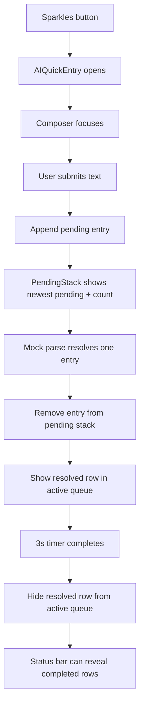

# AI Quick Entry Rapid Queue — Design

**Date:** 2026-05-30
**Branch:** `dev-polish-chat`
**Status:** Proposed for review

## Summary

Redesign the bottom-nav AI Quick Entry overlay for rapid multi-expense entry.
The overlay should stay focused on active work, not become a growing history
list.

There are two important interaction rules:

1. **Resolved rows are temporary in the main queue.** A resolved row appears for
   `3s`, then hides from the active queue. The user can view completed entries
   by tapping the status bar.
2. **Pending rows collapse into a Sonner-style stack.** If the user submits
   faster than parsing resolves, pending entries do not render as a long list.
   They group into a compact stacked presentation with the newest pending entry
   in front and a count for the older pending entries behind it.

Every visible entry row remains one line:

```txt
[icon]  note or submitted input                         amount
```

There are no chat bubbles, no two-line compact rows, no full
`ExpenseListItem` cards, and no per-row expanded cards in this phase. This
remains UI-only / mock-parse work; real parsing, persistence, edit, and review
flows are out of scope.

## Goals

- Support fast entry of many expenses without the overlay growing vertically.
- Keep the composer fixed above the keyboard and focused after every send.
- Show pending work without listing every pending item at full height.
- Confirm each resolved entry briefly, then clear it from the active queue.
- Let users view completed session entries by tapping the status bar.
- Keep each visible entry to one compact row.
- Preserve the existing mocked parse lifecycle and local-only session behavior.
- Prioritize iPhone 13/14 viewport quality.

## Non-Goals

- No real `/api/ai/parse-expense` call.
- No expense create mutation.
- No background sync.
- No bulk save.
- No persistent history after closing the overlay.
- No row expansion into a full card.
- No full `ExpenseListItem` cards inside this quick queue.
- No change to the full `/ai` chat page.
- No change to the bottom-nav Sparkles trigger.

## Current Context

`AIQuickEntry.tsx` currently owns local `entries`, `composer`, and mocked parse
timers. On submit, it appends a pending entry, clears the composer, and later
replaces the pending UI with a real `ExpenseListItem` generated by
`mockParseExpense`.

The submit lifecycle is close to what we need. The presentation needs to change:

- Pending entries can accumulate if the user submits faster than the parse
  delay.
- Resolved entries should not remain visible forever in the active queue.
- Full cards consume too much space for a rapid-entry overlay.

## UX Model

The overlay behaves like a short-lived work queue with a tappable session status.

```txt
┌─────────────────────────────┐
│  7 entries · 2 parsing  ˅    │  <- status bar
│                             │
│  ◉ Cà phê sáng nay    -35k   │  <- resolved, visible for 3s
│                             │
│  ┌───────────────────────┐   │
│  │ … Bánh mì 25k    --   │   │  <- newest pending row
│  └───────────────────────┘   │
│    +1 parsing                │  <- collapsed stack count
│                             │
│  [ Cơm trưa 60k        ↑ ]   │
└─────────────────────────────┘
```

User flow:

1. User opens AI Quick Entry from the bottom nav.
2. Composer focuses above the keyboard.
3. User types an expense and sends.
4. A pending row appears in the pending stack.
5. Composer clears and remains focused.
6. User can immediately type another expense.
7. Each pending entry resolves independently.
8. When an entry resolves, its one-line resolved row appears for `3s`.
9. After `3s`, the resolved row hides from the active queue.
10. User taps the status bar to view completed session rows.
11. Closing the overlay discards the local session.

## Layout

The overlay has three zones:

1. **Status bar:** tappable session summary.
2. **Active queue:** transient resolved rows plus collapsed pending stack.
3. **Composer:** fixed input and send button above the keyboard.

### Status Bar

Purpose: summarize the session and provide access to hidden completed rows.

Examples:

- `1 entry · parsing`
- `4 entries · 2 parsing`
- `7 entries · 5 done`
- `7 entries · 2 parsing · 5 done`
- `3 entries · 1 failed`

Rules:

- Show only after the first entry is submitted.
- Render as a button, not just text.
- Keep it quiet: small text, `text-muted-foreground`, subtle surface if needed.
- Align it with the same `max-w-[390px]` column as the queue.
- Tapping it toggles the completed session view.
- Use a small chevron or state indicator to show whether completed rows are
  visible.
- Do not add instructional copy.

### Completed Session View

When the user taps the status bar, hidden resolved rows become visible in a
compact completed list above the active queue.

Rules:

- Completed rows use the same one-line row component.
- Completed rows are ordered newest first.
- Failed rows remain visible in this view too.
- The view is capped in height and scrollable if needed.
- Tapping the status bar again hides the completed list.
- This is a session-only view; closing the overlay clears it.

This view replaces per-row expansion. It lets the user inspect what was parsed
without keeping every resolved row in the active input area.

### Active Queue

Purpose: show what is currently happening right now.

Contents:

- Recently resolved rows that are still within their `3s` visibility window.
- Collapsed pending stack if there are pending entries.
- Failed row if a future parser failure occurs and needs attention.

Rules:

- Keep the existing mobile column width: `max-w-[390px]`.
- Keep a capped height near the current `max-h-[50vh]`.
- Avoid a long list of pending rows.
- Avoid full cards.
- Auto-scroll to keep the active stack and composer context visible.

## Visibility Rules

### Pending Entries

Pending entries are active until they resolve or fail. They are displayed through
the collapsed pending stack, not as separate full rows.

### Resolved Entries

On resolve:

1. The entry moves from pending to resolved.
2. It appears as a one-line resolved row in the active queue.
3. A `3s` visibility timer starts for that entry.
4. After `3s`, the row hides from the active queue.
5. The row remains available in the completed session view opened from the
   status bar.

The entry is hidden from the active queue, not deleted from local session state.

### Failed Entries

Failed entries should remain visible until the user closes the overlay or opens
the completed/status view. Real failure handling can be finalized during parser
integration, but the row component should have a one-line failed state.

## One-Line Row Design

Create a dedicated `AIQuickEntryRow` component. It replaces the current
`AIEntrySkeleton` pending card and the full `ExpenseListItem` resolved card
inside this overlay.

### Row Grid

All states use the same grid:

```txt
grid-cols-[44px_minmax(0,1fr)_auto]
```

Slots:

- **Left:** category icon, pending indicator, or failed indicator.
- **Middle:** note or submitted input, one line only.
- **Right:** amount, placeholder, or failed marker.

Text rules:

- Middle text is `truncate`.
- Amount uses `tabular-nums`.
- Amount never overlaps the note.
- Row height is stable, target `48-56px`.
- Touch target is at least `44px`.

### Pending Row

Layout:

```txt
[pulse]  submitted input                              --
```

Details:

- Left uses a pulsing neutral circle or small loading indicator.
- Middle shows the exact submitted input, trimmed, one line.
- Right shows a muted placeholder such as `--` or a short skeleton amount bar.
- No separate user bubble.
- No second line.
- No category, budget, paid-by, or helper text.

### Resolved Row

Layout:

```txt
[icon]  parsed note                                -35k
```

Details:

- Left shows the parsed category icon for now.
- Middle shows `result.note || entry.input`, one line.
- Right shows formatted negative amount.
- The row is visible in the active queue for `3s`.
- After `3s`, it moves behind the status bar into completed session view.
- Do not render `ExpenseListItem` in the queue.
- Do not show category name, budget name, paid-by, or sync status in this phase.

### Failed Row

Layout:

```txt
[!]  original input                              Review
```

Details:

- Left uses a warning icon or failed indicator.
- Middle shows the original submitted input.
- Right shows `Review` or a compact warning marker.
- Still one line.
- Detailed error handling is deferred to real parser integration.

## Collapsed Pending Stack

When more than one entry is pending, display pending rows as a collapsed stack
similar to Sonner toasts.

### Stack Rules

- The newest pending entry is the front row.
- Older pending entries appear as offset layers behind the front row.
- Show at most three visual layers.
- Show a compact count for hidden pending entries, for example `+3 parsing`.
- Keep total stack height bounded; it should not grow linearly with pending
  count.
- Pending entries still resolve independently in the background.

### Stack States

One pending entry:

```txt
[pulse]  Bánh mì 25k                              --
```

Two pending entries:

```txt
[pulse]  Bánh mì 25k                              --
  +1 parsing
```

Many pending entries:

```txt
[pulse]  Cơm trưa 60k                             --
  +4 parsing
```

The stack is collapsed by default. This phase does not need an expanded pending
stack view because the user's main task is continuing to type. The status bar
already provides session-level access once entries resolve.

### Pending Resolution From Stack

When any pending entry resolves:

- Remove it from the pending stack.
- Show the resolved row in the active queue for `3s`.
- If the resolved entry was not the front pending row, the front row remains the
  newest still-pending entry.
- Update status bar counts.

## Interaction

### Submit

1. Trim `composer`.
2. Ignore empty input.
3. Append a pending `QuickEntry`.
4. Clear the composer.
5. Trigger medium haptic feedback.
6. Keep focus in the composer.
7. Start the mock parse timer.
8. Render/update the collapsed pending stack.

### Resolve

1. Update only the matching entry by id.
2. Remove that entry from the pending stack.
3. Show its resolved row in the active queue.
4. Start a `3s` active visibility timer.
5. Hide the row from active queue when the timer completes.
6. Keep it in the completed session list.

### Status Bar Tap

Tapping the status bar toggles completed session view:

- Closed: active queue only.
- Open: completed session rows are visible above the active queue.

The composer should remain focused if possible. If opening the completed view
causes scroll or focus changes on iOS, preserving a stable layout matters more
than maintaining focus.

### Row Tap

Rows do not expand in this phase. A row tap should not open a full card.

If row-level edit/review is added later, it should be specified in the real
parse/persistence integration spec.

### Dismiss

- Tapping the scrim closes the overlay.
- Composer blurs.
- Local session entries and timers are cleared on the next open.

## Component Design

### `AIQuickEntry.tsx`

Responsibilities:

- Read `open` from `useAIQuickEntryStore`.
- Hide on `/ai`.
- Own local `composer`.
- Own local `entries`.
- Own mock parse timers.
- Own resolved visibility timers.
- Own completed-view open/closed state.
- Render status bar, completed view, active queue, collapsed pending stack, and
  composer.

Suggested local state:

```ts
const [completedOpen, setCompletedOpen] = useState(false);
const [visibleResolvedIds, setVisibleResolvedIds] = useState<Set<string>>(
  () => new Set()
);
const queueRef = useRef<HTMLDivElement>(null);
const timersRef = useRef<ReturnType<typeof setTimeout>[]>([]);
```

The implementation can avoid storing `visibleResolvedIds` if it stores an
entry-level `visibleUntil` timestamp instead. Choose the simpler testable
approach in implementation.

### Entry State

```ts
type QuickEntryStatus = "pending" | "resolved" | "failed";

type QuickEntry = {
  id: string;
  input: string;
  status: QuickEntryStatus;
  result?: ExpenseListItemData;
  error?: string;
};
```

Derived collections:

- `pendingEntries`: entries where `status === "pending"`.
- `activeResolvedEntries`: resolved entries whose id is currently visible.
- `completedEntries`: resolved or failed entries retained for status view.
- `frontPendingEntry`: newest pending entry.
- `hiddenPendingCount`: `Math.max(0, pendingEntries.length - 1)`.

### `AIQuickEntryStatusBar.tsx`

New presentational component.

Props:

```ts
type AIQuickEntryStatusBarProps = {
  totalCount: number;
  pendingCount: number;
  completedCount: number;
  failedCount: number;
  completedOpen: boolean;
  onToggleCompleted: () => void;
};
```

It renders a compact button with summary text and an open/closed indicator.

### `AIQuickEntryRow.tsx`

New presentational component.

Props:

```ts
type AIQuickEntryRowProps = {
  entry: QuickEntry;
  variant: "pending" | "resolved" | "failed";
};
```

Rendering branches:

- Pending: loading indicator, input, placeholder amount.
- Resolved: category icon, parsed note, formatted amount.
- Failed: warning icon, input, `Review` / marker.

The component should not import or render `ExpenseListItem`.

### `AIQuickEntryPendingStack.tsx`

New presentational component.

Props:

```ts
type AIQuickEntryPendingStackProps = {
  pendingEntries: QuickEntry[];
};
```

Behavior:

- Renders nothing when there are no pending entries.
- Renders the newest pending entry as an `AIQuickEntryRow`.
- Renders one or two decorative backplates when there are older pending entries.
- Renders `+N parsing` for hidden pending count.
- Does not expand in this phase.

### `AIEntrySkeleton.tsx`

Remove it from the AI Quick Entry queue path. Delete it if no other component
uses it.

### `ExpenseListItem`

No changes. It remains the normal expense-list component.

## Data Flow



No server state is introduced. No TanStack Query change is needed.

## Visual Details

- Active queue should feel compact and anchored above the composer.
- Pending stack should visually borrow from Sonner: front row, subtle backplates,
  small count text.
- Backplates are decorative only and should not look like individual readable
  rows.
- Resolved rows should feel like brief confirmations.
- Completed session view should feel like a lightweight drawer/list, not a full
  history page.
- Do not use chat bubbles or right-aligned user messages.
- Do not use a second row line.

## Animation

- Pending stack insertion: subtle fade/translate, `150-200ms ease-out`.
- Stack count changes should not cause layout jumps.
- Resolved row appears with a small fade/translate.
- Resolved row hides after `3s` with a shorter fade, around `120-160ms`.
- Do not animate row height.
- Do not animate the composer on every submit.
- Respect reduced motion if adding custom motion.

## Accessibility

- Overlay keeps `role="dialog"` and `aria-label="AI quick entry"`.
- Composer keeps its label.
- Send button keeps `aria-label="Send expense"`.
- Status bar is a real button with an accessible label, for example:
  `AI quick entry status: 7 entries, 2 parsing, 5 completed. Show completed entries.`
- Pending stack exposes the newest pending entry and pending count.
- Resolved rows expose text such as `Parsed expense: Cà phê, 35k`.
- Hidden resolved rows should not be announced again when they merely move into
  completed view.
- If completed view is opened, rows are readable in order.

## Edge Cases

### Empty Input

Send remains disabled for empty or whitespace-only composer text.

### Long Input

Middle text truncates in all one-line rows.

### Duplicate Input

Allowed. Each submission gets its own id.

### Rapid Submits

Allowed. Pending stack stays collapsed regardless of pending count.

### Resolve Order

Entries may resolve out of order. The active resolved row should appear when its
own parse completes. Pending stack should always show the newest still-pending
entry.

### Many Completed Entries

Completed session view becomes scrollable. Status bar remains visible.

### Closing With Pending Or Visible Resolved Entries

Closing discards the visible session. Reopening starts fresh.

### `/ai` Route

No change. The quick overlay remains hidden on `/ai`.

## Testing Plan

### `AIQuickEntry.test.tsx`

- Opens when store `open` becomes true.
- Renders nothing on `/ai`.
- Submit appends a pending entry and clears composer.
- One pending entry renders as one pending row.
- Multiple pending entries render as a collapsed stack, not multiple rows.
- Pending stack shows newest pending entry and hidden pending count.
- Rows resolve independently after timers advance.
- Resolved row appears in active queue after resolve.
- Resolved row hides from active queue after `3s`.
- Hidden resolved row appears when status bar is tapped.
- Status bar toggles completed session view.
- Closing and reopening clears entries and timers.

### `AIQuickEntryRow.test.tsx`

- Pending row renders left indicator, input, and placeholder amount.
- Resolved row renders icon, note, and amount.
- Failed row renders warning state, input, and review marker.
- Row contains no second text line.
- Row does not render `ExpenseListItem`.

### `AIQuickEntryPendingStack.test.tsx`

- Renders nothing with no pending entries.
- Renders one row with one pending entry.
- Renders only the newest pending row when multiple entries are pending.
- Renders hidden pending count.
- Uses decorative backplates for collapsed state.

### `AIQuickEntryStatusBar.test.tsx`

- Renders total, pending, completed, and failed counts.
- Toggles completed view when clicked.
- Provides an accessible label.

### Removed / Updated Tests

- Remove or rewrite `AIEntrySkeleton.test.tsx` if `AIEntrySkeleton` is deleted.
- Update current `AIQuickEntry.test.tsx` mocks to assert row, stack, timer, and
  status behavior instead of skeleton behavior.

## Acceptance Criteria

- User can submit many expenses rapidly without a tall pending list.
- Multiple pending entries display as a collapsed Sonner-style stack.
- The stack shows the newest pending entry and a hidden pending count.
- Each resolved entry appears in the active queue for `3s`.
- Resolved entries hide after `3s`.
- Tapping the status bar reveals completed resolved rows.
- Status bar toggles completed view open and closed.
- Every row remains one line: icon/status, note/input, amount/status.
- Composer remains fixed and focused after submit.
- No chat bubbles, no full cards, and no row expansion are introduced.
- No real API call, mutation, sync, or persistence is introduced.
- Mobile layout remains coherent on iPhone 13/14 width.
- Targeted tests, Prettier, and ESLint pass for modified files.

## Review Decisions

This revision makes the following design decisions explicit:

- **Active queue only:** resolved rows are temporary confirmations, not permanent
  visible history.
- **Resolved visibility duration:** active resolved rows hide after `3s`.
- **Status bar as history access:** completed entries are reviewed by tapping the
  status bar.
- **Collapsed pending stack:** many pending entries use a Sonner-style collapsed
  stack instead of a list.
- **One-line rows only:** no secondary metadata line.
- **No `ExpenseListItem` in the quick queue:** use dedicated compact row
  components.
